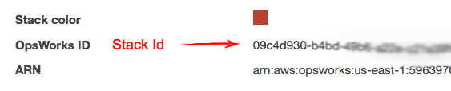

# Opie

## A Simplified Command Line Tool for AWS OpsWorks


### What's Opie?

Opie is a command line tool that makes it easy to start/stop instances and deploy apps in AWS OpsWorks.


### Usage

```sh
# install it (globally)
$ npm install opie -g

# use it
$ opie --help

# configure your Stack ID (OpsWorks ID)
$ opie add-stack 01234567-abcd-0123-abc-abcd1234efgh

# displays a list of instances and apps for each configured stack
$ opie list

# start an instance
$ opie start myappserver01

# deploy an app to an instance
$ opie deploy myapp myappserver01

```

### Stack Id / OpsWorks Id
The Stack Id is called OpsWorks Id in AWS and can be found on the stack settings screen.



> **Pro Tip!**  
> You can have more than one stack.  Just call ``add-stack`` for every stack you have.


### Commands

  - **start** : start an instance ``opie start <instance> [stack]``
  - **stop** : stop an instance ``opie stop <instance> [stack]``
  - **deploy** : deploy an app to an instance ``opie deploy <app> <instance> [stack]``
  - **list** : list the configured stacks ``opie list``
  - **add-stack** : add a stack id to the configuration ``opie add-stack <stack id>``


> **Pro Tip!**  
>   You only need to include the *stack* argument if more than one stack has the same instance name.
>   
>    You can include a comment with the ``deploy`` command by using ``--comment "your comment"``.


### Config

A config file will be generated into your home dir.  The region defaults to "us-east-1", if you need to change it you'll need to edit this file.

``~/.opie.json``


<br/>

[](https://www.npmjs.com/package/opie)
